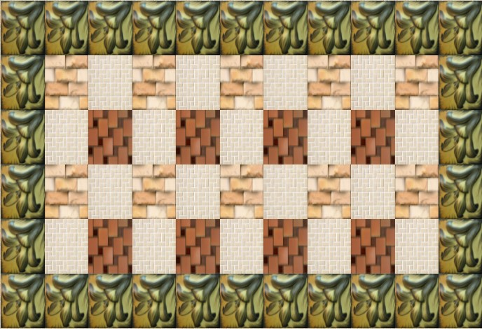
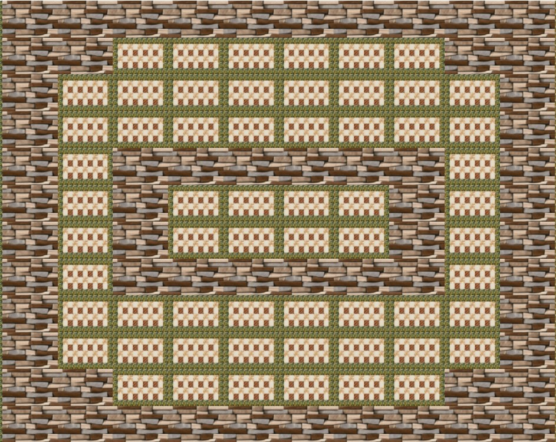
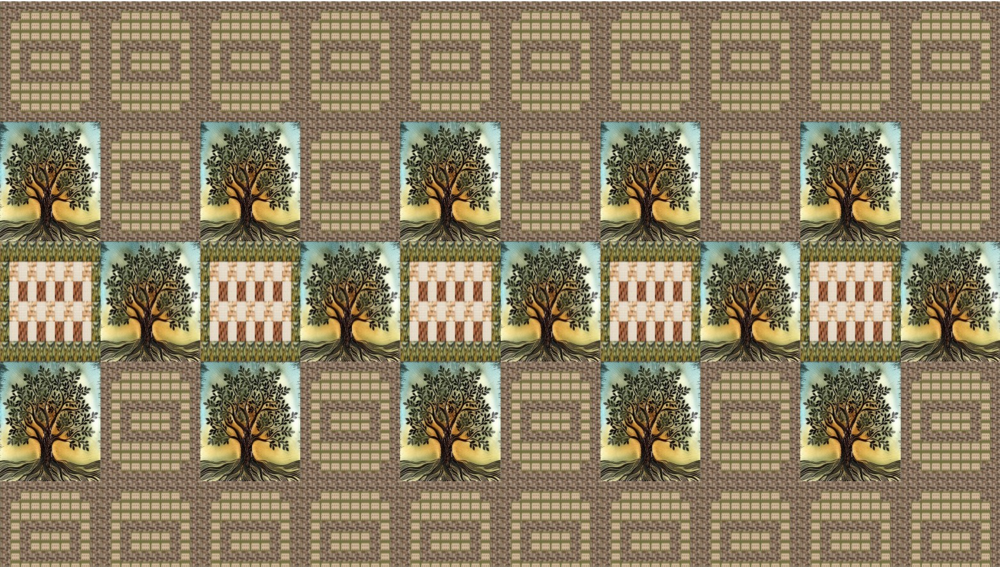
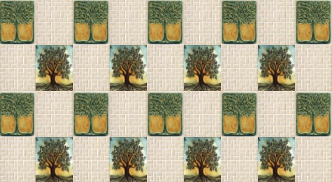

# Tiles
 This is a frontend prototype for businesses who sell the products that require 2D design to assist customers visualize the pattern and embellishments.
# Getting Started

  ## Pre-requisites
  
  * HTML 5
  * CSS 3
  * JQuery
  * Javascript

  ## Steps

  1. Clone the repository
  2. Navigate to tiles.html.
  3. Fill out the form and select a picture
  4. Complete and submit the form
  5. If the display is too large, zoom out to see the complete 2D wall.
  6. Select the image on a certain spot.
  7. Drag the image to a new position to duplicate it.
  8. Use interactive design to visualize diverse patterns.

  ## 1. Clone the repo: 
  Clone the Image Processing repo locally. In a terminal, run:   
  
        ```
        $ git clone https://github.com/GaurangSharma18/Tiles.git
        $ cd tiles
        $ git pull
        ```

# Examples of patterns formed by the business.

### Pattern 1
<div float="left">
   
</div>


### Pattern 2
<div float="left">
   
</div>

### Pattern 3
<div float="left">
   
</div>

### Pattern 4
<div float="left">
   
</div>

